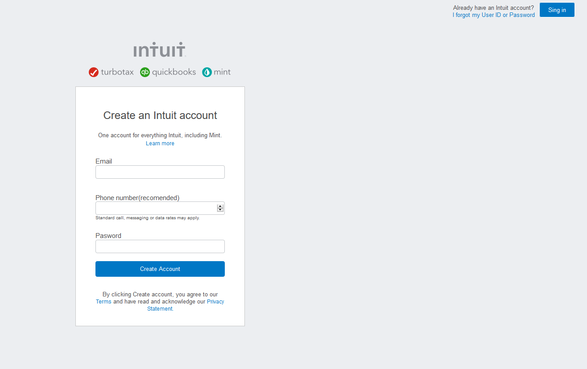

# Project Name

> HTML Forms

The second project for microverse, replicate mint subcribe page
example: https://accounts.intuit.com/signup.html?offering_id=Intuit.ifs.mint&namespace_id=50000026&redirect_url=https%3A%2F%2Fmint.intuit.com%2Foverview.event%3Ftask%3DS

## Built With

- Html, css,
- No frameworks,

## Live Demo

[Live Demo Link](https://nexch.github.io/form_2/index.html)

## Getting Started

**This is an example of how you may give instructions on setting up your project locally.**
**Modify this file to match your project, remove sections that don't apply. For example: delete the testing section if the currect project doesn't require testing.**

To get a local copy up and running follow these simple example steps.

### Prerequisites

Having a computer and git working.

### Setup

git clone https://github.com/Nexch/form_2.git

### Usage

Open it in your favorite browser

## Authors

👤 **Author1**

- Github: [@Ramon-Carrillo](https://github.com/Ramon-Carrillo)
- Twitter: [@Ramon-Carrillo](https://twitter.com/twitterhandle)
- Linkedin: [linkedin](https://linkedin.com/linkedinhandle)

👤 **Author2**

- Github: [@Nexch](https://github.com/Nexch)
- Twitter: [@@MfinchT](https://twitter.com/MfinchT)
- Linkedin: [linkedin](www.linkedin.com/in/Nexch)

## 🤝 Contributing

Contributions, issues and feature requests are welcome!

Feel free to check the [issues page](issues/).

## Show your support

Give a :fire: if you like this project!

## Acknowledgments

- I will like to express my sincere gratitude to Microverse, for giving me and my partner, this incredible opportunity
- Microverse

## 📝 License

This project has no license.
